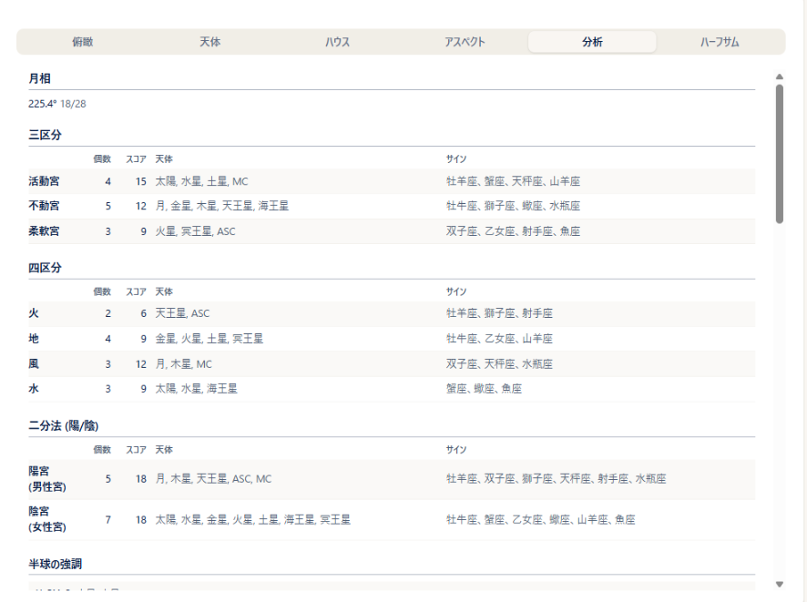
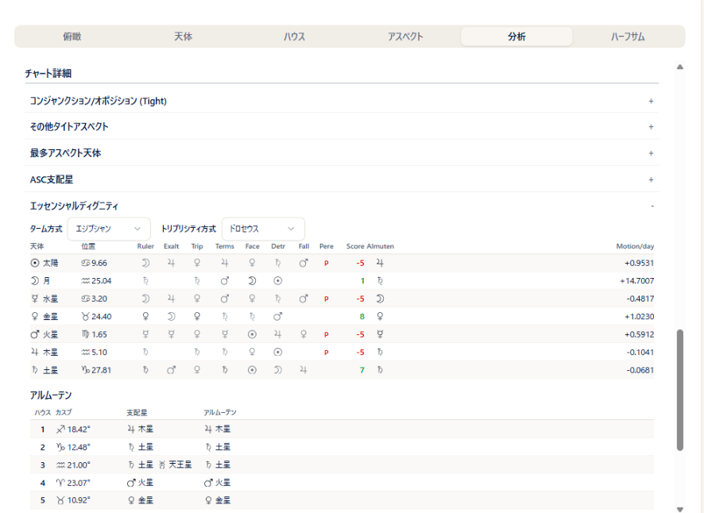
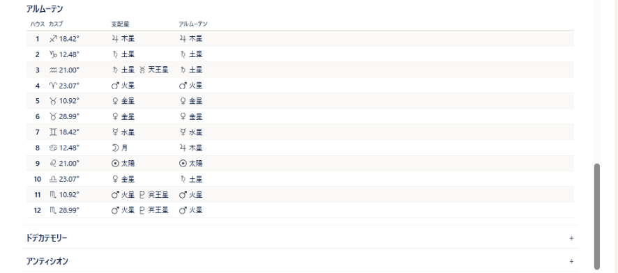

# 分析タブ

!!! abstract "この章について"
    この章では、一重円（ネイタル）の右パネルにある「**分析**」タブの各項目の見方をまとめます。分析タブは、チャート全体の傾向をまとめた **集計**（月相・三区分・四区分など）、[ディスポジター](dispositor.md) の図、そして「**チャート詳細**」に折りたたまれた個別の一覧（タイトなアスペクト・**エッセンシャルディグニティ**・**アルムーテン** など）で構成されています。

    同じ内容は、二重円のコンポジット・ダビソン、三重円の一部でも見られます（章末の「他の画面で見る」）。

    各項目の占星術的な意味や読み方は、本マニュアルでは扱いません。講座や書籍で学んだ内容でご判断ください（[占星術の基礎知識](basics.md) もご参照ください）。

## 分析タブを開く

### 操作手順

1. [一重円](single-chart.md) の画面で「**チャートを表示**」を押します。
2. 右側のデータタブから「**分析**」を開きます（スマホの場合はチャートの下に表示されます）。
3. 上から順に、集計の各項目、ディスポジターの図（**Pro 以上**）、「チャート詳細」が並びます。「チャート詳細」の各項目は、見出しをクリック／タップすると開閉します（初期状態は閉じています）。

### 補足説明

- 「チャート詳細」のうち、該当するものがない項目（例：ミューチュアルリセプションがない）は表示されません。
- 出生時刻が不明な出生データでは、ハウスやアングル（ASC・MC）を使う項目は表示されません（各項目の説明を参照）。
- 龍頭図・龍尾図（ドラコニックチャート）を表示している間は、分析タブ自体が表示されません。
- 分析タブの各項目は、ゴークランセクターの天体とディスポジターの図を除いて、一重円の印刷にも含まれます（エッセンシャルディグニティは **Pro 以上**）。

## 集計の見方

分析タブの上段には、次の項目が並びます。

- **月相**: 太陽から月までの離角（度）と、それを 28 日周期で数えた月齢（例：13/28）を表示します。同じ内容は「天体」タブの下部にも表示されます。
- **三区分**／**四区分**／**二分法（陽・陰）**: それぞれ 活動宮・不動宮・柔軟宮 ／ 火・地・風・水 ／ 陽宮（男性宮）・陰宮（女性宮）の行に分けて、次の列を表示します。
    - **個数**: その区分に入っている天体の数
    - **スコア**: 天体ごとに重みを付けて集計した値
    - **天体**: その区分に入っている天体
    - **サイン**: その区分に属するサイン
    - 出生時刻が不明な場合、ASC・MC は集計に含まれません。
- **半球の強調**: チャートを 4 つの区分（11-2H・2-5H・5-8H・8-11H）に分けて、それぞれに入っている天体の個数と天体を表示します。ハウスを使うため、出生時刻が不明な場合は表示されません。
- **ゴークランセクターの天体**: ASC・MC・DES・IC のそれぞれについて、そのアングルの近く（ゴークランセクター）にある天体を表示します。該当がないアングルは「-」です。どのアングルにも該当がない場合は項目ごと表示されません。出生時刻が不明な場合は「出生時刻不明のため表示できません」と表示されます。
- **ステリウム**: 天体が集中しているサインと、そのサインに入っている天体を表示します。サイン名にカーソルを合わせると、サインの意味が表示されます。該当がない場合は項目ごと表示されません。
- **特殊度数**: サインの 0 度台または 29 度台にある天体を、「天体 - 0度台／29度台（度数）」の形で表示します。該当がない場合は項目ごと表示されません。
- **ディスポジター**: 支配星をたどる矢印の図です（**Pro 以上**）。見方は [ディスポジター](dispositor.md) の章をご覧ください。

## チャート詳細の見方

### タイトアスペクトと天体の一覧

- **コンジャンクション/オポジション (Tight)**: オーブの小さいコンジャンクションとオポジションの一覧です。列は 天体1／アスペクト記号／角度／天体2／オーブ です。
- **その他タイトアスペクト**: コンジャンクション・オポジション以外で、オーブの小さいアスペクトの一覧です。列は上と同じです。
- **最多アスペクト天体**: アスペクトの数が最も多い天体と、その数を表示します。同数の天体が複数あれば、すべて表示されます。
- **アンギュラー天体**: ASC・MC の近くにある天体を表示します。出生時刻が不明な場合は表示されません。
- **ASC支配星**: ASC のサインの支配星を表示します。出生時刻が不明な場合は表示されません。
- 上の 4 項目（タイトアスペクト 2 つ・最多アスペクト天体・アンギュラー天体）は、選択中のプリセットで表示している天体だけが対象です。出生時刻が不明な場合、ASC・MC などのアングルを含むアスペクトは一覧から除かれます。

### エッセンシャルディグニティ（Pro 以上）

「**エッセンシャルディグニティ**」を開くと、方式の選択・ディグニティ表・ハウスカスプのアルムーテン表の 3 つが表示されます。

**方式の選択**

- 表の上の「**ターム方式**」（エジプシャン／プトレマイオス）と「**トリプリシティ方式**」（ドロセウス／プトレマイオス／リリー）で、判定に使う方式を切り替えられます。切り替えるとチャートが自動で再計算され、表が更新されます。
- ここでの切り替えは一時的なもので、プリセットには保存されません。いつも同じ方式で表示したい場合は、[設定](settings.md) の「ターム方式」「トリプリシティ方式」で選んで、プリセットに保存してください。

**ディグニティ表**

太陽から土星までの 7 天体を 1 行ずつ、次の列で表示します。

| 列 | 内容 |
|---|---|
| 天体 | 天体の記号と名前 |
| 位置 | 在住サインと度数 |
| Ruler / Exalt / Trip / Terms / Face | その位置でルーラー（支配）／エグザルテーション（高揚）／トリプリシティ／ターム／フェイスにあたる天体の記号。行の天体自身があてはまる場合は濃い色（太字）で、他の天体の場合は薄い色で表示されます |
| Detr / Fall | その位置でデトリメント（障害）／フォール（転落）にあたる天体の記号。表示のしかたは上と同じです |
| Pere | ペレグリン（どのディグニティも持たない）にあたる場合に、赤字で「P」と表示されます |
| Score | 上の各ディグニティを合計した点数。プラスは緑、マイナスは赤で表示されます |
| Almuten | その天体の位置での **アルムーテン**（各ディグニティを総合して、その度数で最も優勢な天体）の記号 |
| Motion/day | 1 日あたりの移動度数。マイナスは逆行中です |

- ターム／トリプリシティの判定は、上で選んだ方式に従います。
- **Score の配点**: ルーラー +5／エグザルテーション +4／トリプリシティ +3／ターム +2／フェイス +1（あてはまるものを合算）と、デトリメント −5／フォール −4 の減点の合計です。ペレグリンは −5 です（デトリメント・フォールの減点がある場合は、ペレグリンの減点は重ねません）。
- エッセンシャルディグニティの配点は流派やソフトによって異なります。このため、スコアの数値は他のソフトや他の先生の鑑定と一致しないことがあります。

**ハウスカスプのアルムーテン表**

ディグニティ表の下に、「**アルムーテン**」の見出しで、各ハウスカスプの表を表示します。列は ハウス／カスプ（サインと度数）／支配星／アルムーテン です。

- 出生時刻が不明な場合は、支配星とアルムーテンの欄は空欄（-）になります。
- 度数の表記（10進／度分）は、設定の度数モードに従います。

### 古典系の一覧

- **ドデカテモリー**: 各天体について、天体／サイン／ドデカテモリーサイン を表示します。
- **アンティシオン**: 各天体について、天体／アンティシオン／コントラ・アンティシオン（それぞれサインと度数）を表示します。この一覧はプランに関係なく表示されます。[古典（プロフェクション・ロット）](traditional.md) の章の「アンティシア」（円盤への表示・コンタクト一覧。**Max**）とは別の項目です。
- **ミューチュアルリセプション**: 互いに相手の支配サインに在住している 2 天体の組を「天体A - 天体B」の形で表示します。判定に使う支配星の範囲が異なるため、[ディスポジター](dispositor.md) の図の下に表示される「相互リセプション」と内容が一致しないことがあります。

## 他の画面で見る

- **二重円（コンポジット・ダビソン）**: 右パネルの「**分析**」タブに、この章と同じ内容が表示されます（[二重円](double-chart.md) の章の「右パネルの見方」）。A・B のどちらかの出生時刻が不明な場合は、一重円で出生時刻が不明なときと同じ扱いになります。エッセンシャルディグニティの方式の選択を切り替えた場合は、もう一度「チャートを表示」を押すと反映されます。シナストリーには分析タブはありません。
- **三重円**: 右パネルの「**ネイタル (N)**」「**ディレクション (D)**／**セカンダリー (P)**」「**トランジット (T)**」の各タブで、天体表の右下にある「**エッセンシャルディグニティ**」ボタンを押すと、この章の「エッセンシャルディグニティ」と同じ表が別画面で開きます（**Pro 以上**）。ハウスカスプのアルムーテン表が付くのはネイタル (N) のみです。方式の選択もここで切り替えられます。
- **リターン図・ハーモニック**: 分析タブとエッセンシャルディグニティ表はありません。
