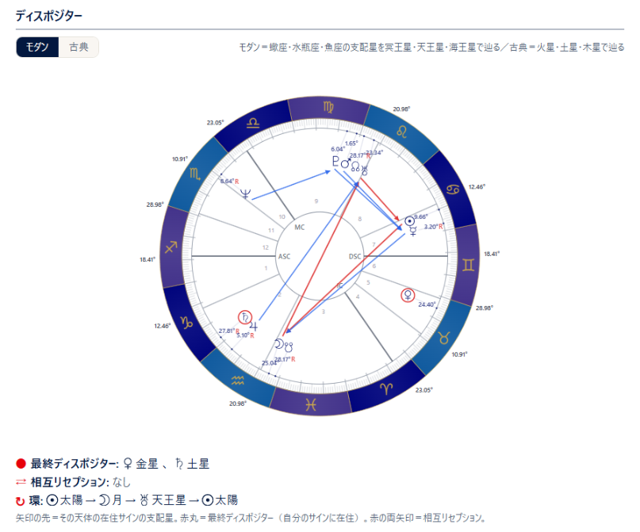

# ディスポジター

!!! abstract "この章について"
    この章では、一重円（ネイタル）の「**分析**」タブに表示される **ディスポジターの図** の見方と操作をまとめます。各天体から、その天体が在住しているサインの支配星へ矢印を引いた図で、支配の連なりをたどることができます。**Pro プラン以上** でご利用いただけます。

    旧スタナビの「出生図解読レポート」の末尾にあった「ディスポジター」の図と同じ読み方です。

## ディスポジターの図を見る

### 操作手順

1. [一重円](single-chart.md) の画面で「**チャートを表示**」を押します。
2. 右側のデータタブから「**分析**」を開きます（スマホの場合はチャートの下に表示されます）。
3. 「**ディスポジター**」の見出しの下に図が表示されます。図の上の「**モダン**」「**古典**」で、支配星の体系を切り替えられます。
4. 図をクリック／タップすると拡大表示になります。拡大画面では画像として保存できます。

### 図の見方

- **矢印**: 各天体から、その天体が在住しているサインの支配星へ向かって矢印が引かれます。矢印の先の天体が、その天体のディスポジターです。矢印をたどっていくと、支配の連なりの行き着く先がわかります。
- **赤い丸**: 自分のサインに在住している天体（**ファイナルディスポジター**）は、天体の記号が赤い丸で囲まれます。この天体からは矢印は出ません。
- **赤い両方向の矢印**: 2つの天体がお互いのサインに在住している場合（**ミューチュアルレセプション**）は、2つの天体の間に赤い両方向の矢印が引かれます。
- 3つ以上の天体が輪になって支配し合っている場合は、その部分の矢印が赤で表示されます。
- 図の下には、**ファイナルディスポジター** と **ミューチュアルレセプション** の一覧が表示されます。該当する天体がない場合は「なし」と表示されます。

### 補足説明

- 「**モダン**」は、蠍座・水瓶座・魚座の支配星を冥王星・天王星・海王星として矢印を引きます。「**古典**」は、火星・土星・木星として矢印を引きます。それ以外のサインは同じです。初期状態はモダンで、選んだ側はお使いのブラウザに保存され、次回以降も同じ側で表示されます。
- 対象になる天体は、太陽・月・水星・金星・火星・木星・土星・天王星・海王星・冥王星の10天体です。ドラゴンヘッド／テイルやASC・MC、小惑星は矢印の対象になりません。
- 図に表示される天体は、設定画面の「**天体表示**」（一重円）で選んでいる天体に従います。表示していない天体は矢印も表示されません。
- 図の色（帯の配色）や記号は、選択中のカラーテーマと記号の設定に従います。
- 出生時刻が不明な出生データでも表示できます（サインだけで決まるため）。
- 龍頭図・龍尾図（ドラコニックチャート）を表示している間は、分析タブと同様に表示されません。
- 図は一重円の画面のみで、印刷には含まれません。
