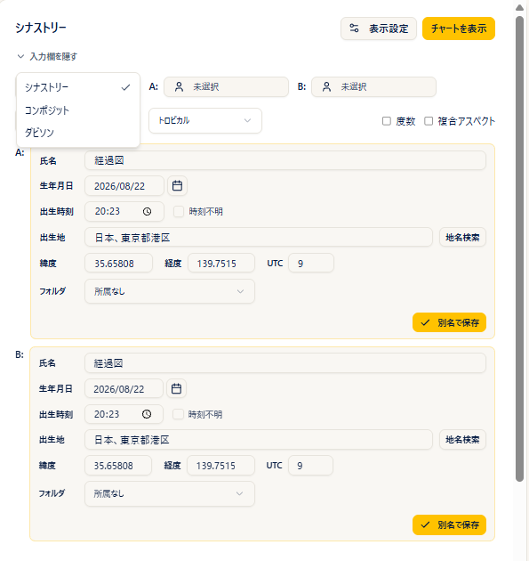
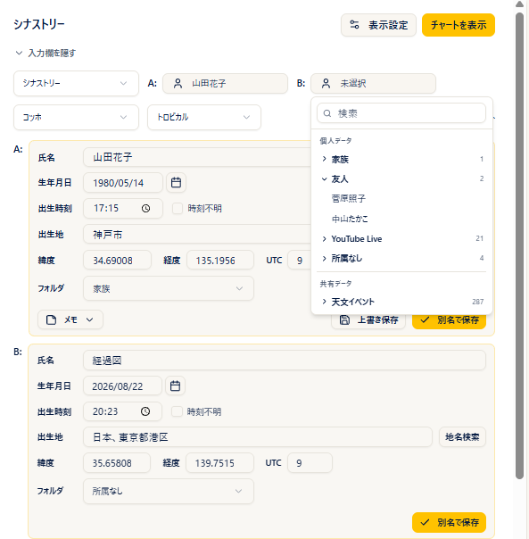
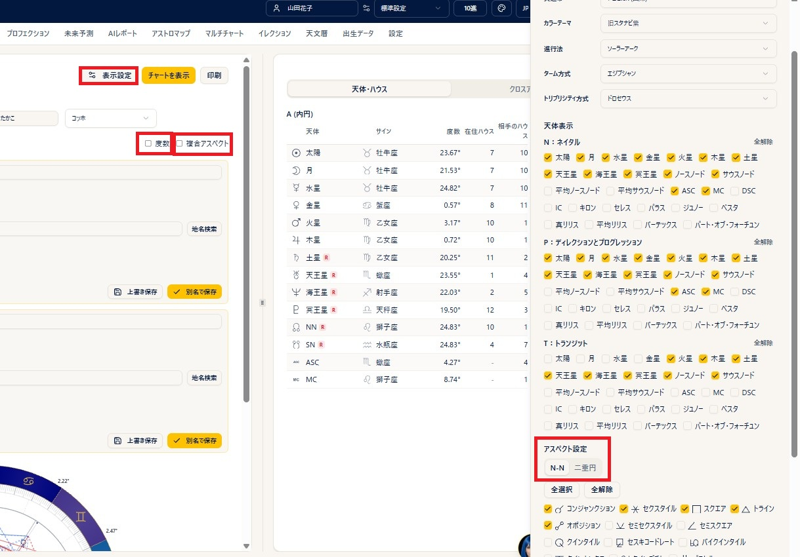
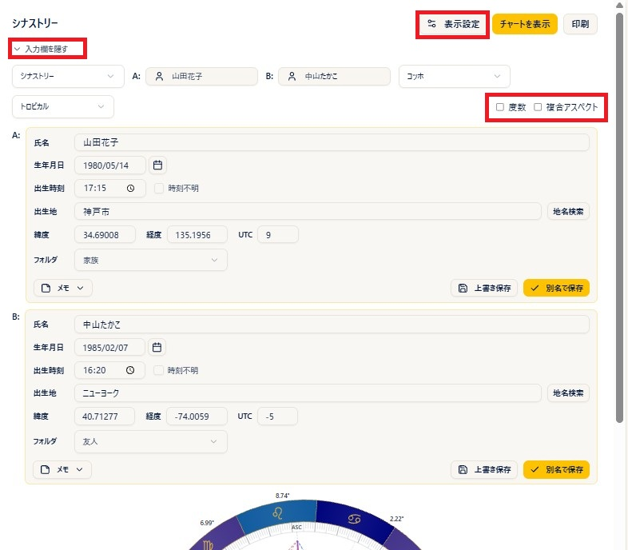

# Synastry

!!! abstract "About this chapter"
    This chapter covers the double wheel — two charts viewed together. There are three kinds: **synastry**, **composite**, and **Davison**.

    For the astrological thinking behind synastry, see also [Synastry](https://www.arijp.com/basis/synastry) on the ARI official site (in Japanese).

## Choosing the chart type

### Steps

1. Open **Synastry** from the menu.
2. Choose **Synastry**, **Composite**, or **Davison** from the type selector at the top left.
3. Switching the type recalculates automatically using the data you have already entered.

### Notes

- **Synastry**: shows two natal charts together, one on the inner ring and one on the outer ring.
- **Composite**: a combined chart built from the midpoints of the two charts (shown as a single circle).
- **Davison**: a chart built from the average of the two birth dates, times, and places (shown as a single circle). The **Mean Datetime** and **Mean Location** are shown below the chart.
- Types your plan does not include are marked with a lock icon and cannot be selected.

!!! info "Plans"
    Synastry = free and above / Composite = **Pro and above** / Davison = **Max and above**.

## Creating a double wheel

### Steps

1. In the input fields, choose a saved birth data record from the **A (inner ring)** picker and another from the **B (outer ring)** picker.
2. To correct data on the spot, use the **pencil (edit)** under each person (press **Recalculate** to apply your edits).
3. Choose a **house system** if you need to.
4. Press **Show Chart** and the double wheel appears.

### Notes

- If you leave one of the pickers empty, that slot is filled with "the current time at your default observation location". You can use this to overlay a transit chart on a natal chart and read the influence of the transits.
- Once the calculation succeeds, the input fields collapse automatically. **Show inputs** opens them again.
    
- In synastry, **A is the inner ring and B the outer ring**. Composite and Davison are shown as a single circle.

## Overlaying a new or full moon chart on the natal chart

### Steps

1. Leave the chart type as **Synastry** and choose the birth data for **A (inner ring)**.
2. In the **B (outer ring)** picker, choose the new or full moon you want to overlay from the astronomical events under **Shared Data**.
3. Press **Show Chart** and the double wheel appears with the new (or full) moon chart over the natal chart.

### Notes

- You can read the influence of the new or full moon on the natal chart through the cross aspects.
- You do not have to register the astronomical events yourself. For details see "Shared data" in the [Clients](birth-data.md) chapter.

## Reading the right panel

### For synastry

- **Planets & Houses** tab: the list of planets for A and for B. **Own House** is the house in that person's own chart and **Other's House** is the house the planet falls into in the other person's chart (the headings read "A (Inner)" and "B (Outer)").
- **Cross Aspects** tab: shows planets, aspects, **orbs**, and keywords in three sections — **A × B Cross Aspects**, **A Natal**, and **B Natal**. The keyword column shows up to the first four; when there are more, clicking (tapping) opens the full text in a pop-up (orbs within one degree are shown in bold).
    
- **Grid** tab: shows the A × B cross grid (with the **compatibility colors** described in the next section) plus the natal grid for A and for B. The cross grid is oriented **A down, B across**.

### For composite and Davison

- These are shown with four tabs — **Planets / Houses / Aspects / Analysis** — the same arrangement as the single wheel.

## Compatibility colors (the coloring of the cross grid)

On the Grid tab for synastry, the **harmonious aspects** and **tension aspects** that matter most when looking at compatibility are colored in **three colors**, based on **ARI's own interpretation** (aspects within an orb of 5 degrees). It makes compatibility easy to read at a glance.

- **Red**: strong tension aspects
- **Orange**: challenging aspects
- **Blue**: harmonious aspects

This **compatibility color legend** is shown below the grid.

!!! note "Before you use it"
    This coloring is one view, based on ARI's own interpretation. When you interpret a chart, your own thinking and judgment come first.

## Aspects and aspect patterns

### Notes

- The wheel is drawn with the A × B cross aspect lines plus the lines among A's own planets and among B's own planets (following the on/off setting and the orbs; wide orbs are drawn as dotted lines).
- Ticking **Degrees** shows the degree next to each planet on the wheel.
- The aspect types, orbs, and colors used for the synastry cross aspects come from the **Synastry** tab of the aspect settings in [Settings](settings.md) (or the Display Settings panel). Composite and Davison are treated as a single natal chart, so they use the **N-N** tab.
- **The Moon of a person whose birth time is unknown** is excluded from the cross aspects. The Moon is calculated as of 12:00 (noon), but even so the actual birth time can shift it by 6-7 degrees. (The ASC and MC of a person whose time is unknown are excluded in the same way.)
- **Aspect patterns**: turning on the **Aspect Patterns** checkbox calculates and displays the combined A + B patterns (**Basic plan and above**; the calculation takes a little time, so turn it on only when you need it).
- Clicking a planet pops up the list of aspects to it, including whether each is **applying or separating** (badges are red for the inner ring A and blue for the outer ring B). Angles such as the **ASC and MC** can be clicked too.
- For the basics of aspects, see also [Aspects](https://www.arijp.com/basis/aspect) on the ARI official site (in Japanese).

## Display and printing

### Steps

1. Ticking **Degrees** shows the degree of each planet on the wheel.
2. The **Print** button prints the chart and the data (**Basic plan and above**).
3. Clicking the wheel enlarges it, and from the enlarged view you can save the image with **PNG** (PNG saving is **Basic plan and above**).

### Notes

- The **Display Settings** button lets you adjust the planets and aspects shown on the spot (**Plus plan and above**).
- **Show asteroids and points** is a simple toggle for free and guest users (on Basic and above these are managed on the settings screen).
- Degree notation (decimal or degrees-minutes) follows the degree mode in the settings.
