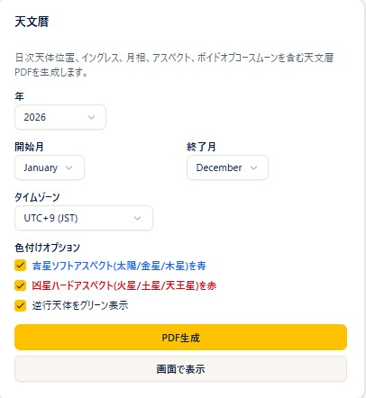

# Ephemeris

!!! abstract "About this chapter"
    This chapter covers the standalone **Ephemeris** page. Here you can generate and download an ephemeris for a period you specify as a **PDF**. The ephemeris is available on the **Plus plan and above**.

    It is a different feature from the **Ephemeris** button introduced in the [Progression](triple-chart.md) chapter (which opens three months of ephemeris data in a dialog on the screen). This one is a standalone page that outputs a PDF file.

    For the basics of retrograde motion, see also [Direct and retrograde motion](https://www.arijp.com/basis/retrograde) on the ARI official site (in Japanese).

## Creating an ephemeris PDF

{ width="460" }

### Steps

1. Open **Ephemeris** from the menu.
2. Choose the **Year** (from the list).
3. Choose the **From** and **To** months. Choosing a To month earlier than the From month adjusts them automatically (and the same the other way around).
4. Choose the **Timezone** (**UTC+9 (JST)** / **UTC+0 (GMT)** / **UTC+1 (CET)** / **UTC-5 (EST)** / **UTC-8 (PST)**). The default is **UTC+9 (JST)**.
5. Set the **Color Options** if you want to (see the next section).
6. Press the **Generate PDF** button. While it runs, the button changes to **Generating...**.

### Notes

- The generated ephemeris is **downloaded as a PDF file**. It also opens in a new tab (it is not shown within the page).
- The PDF contains the daily positions of the bodies, ingresses, moon phases, aspects, the void-of-course Moon (VOC), and more.
- The longer the period, the longer generation takes. Specifying only the months you need makes it faster.
- Even if your browser's pop-up blocker prevents the new tab from opening, the download still happens.

## Color options

### Steps

1. The checkboxes under **Color Options** switch the coloring inside the PDF.
2. Set them and then press **Generate PDF**, and the output uses the coloring you specified.

### Notes

- **Benefic soft aspects (Sun/Venus/Jupiter) in blue**: shows those aspects in blue (off by default).
- **Malefic hard aspects (Mars/Saturn/Uranus) in red**: shows those aspects in red (off by default).
- **Retrograde planets in green**: shows retrograde bodies in green (on by default).

!!! info "Plans"
    The ephemeris is available on the **Plus plan and above** (a lock icon on the menu means your plan cannot open it).
