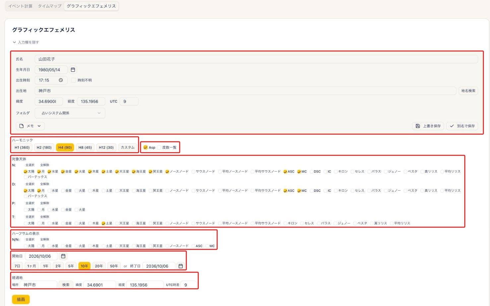
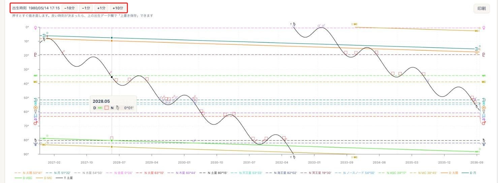

# 未来予測

!!! abstract "この章について"
    この章では、未来予測の使い方をまとめます。未来予測は、指定した期間の中で **アスペクトが形成される時期** などを抽出する機能です。画面には **イベント計算 / タイムマップ / グラフィックエフェメリス** の3つのタブがあります。未来予測は **Plus プラン以上** でご利用いただけます（グラフィックエフェメリス＝**Pro 以上**、タイムマップ＝**Max**）。

## イベントプリセット（手軽に使う）

### 操作手順

1. ヘッダーの出生データピッカーで、未来予測したい **出生データ** を選びます。
2. メニューから「**未来予測**」を開きます。
3. 「**イベントプリセット**」から、「**軸通過**」「**成功相**」「**恋愛運**」「**大きな出来事**」のいずれかを選びます（計算条件が自動でセットされます）。
4. 「**開始年月日**」を入力します。
5. 期間を指定します（「**7日 / 1ヶ月 / 1年 〜 50年**」のボタン、または「**終了年月日**」で任意指定）。ボタンを押すと、「**終了年月日**」の欄も開始年月日＋期間の日付に変わります。
6. 「**計算**」を押すと、対象の時期が一覧で表示されます。

### 補足説明

- **軸通過**：ASC・MC に関わる時期に絞り込みます。
- **成功相**：太陽・木星・冥王星・MC を対象にします。
- **恋愛運**：金星に関わる時期に絞り込みます。
- **大きな出来事**：主要な天体を対象にし、結果の行が色分けされます。色がついているものは、現実化しやすい天体を含むもので、赤はハード寄り、青はソフト寄りのアスペクトを示します。ただし、正確な解釈のためには個人の出生図を読み込む必要があります。
- 「**なし**」を選ぶとプリセットが解除されます。
- プリセットで使う天体は経過地の違いによって大きな影響を受けないので、出生地のままでも問題ありません。

## 詳しい条件を自分で指定する

### 操作手順

1. 「**計算タイプ**」を選びます（複数選択可）。例：**N-D（ソーラーアーク）／N-T（トランジット）／N-P（セカンダリ）／P-P／P-T／D-T／T-T／T→ハウス入室** など。
2. 「**対象天体**」で、見たい天体を選びます（「**全選択**」「**全解除**」）。
3. 「**アスペクトの設定**」で、見たいアスペクトの種類と **オーブ** を指定します。
4. 「**開始年月日**」「**経過地**」を設定します（経過地は「**検索**」で地名から緯度・経度を入力できます）。開始年月日の横にも **オーブ** の入力欄があります。
5. 「**詳細設定**」を開くと、ハーフサム感受点や移動天体のミッドポイントを含めることもできます。
6. 「**計算**」を押します。

### 補足説明

- オーブの入力欄は2種類あります。
    - 「**アスペクトの設定**」の各行（N-D／N-T／N-P など）の横の欄は、**その計算タイプだけ** に適用される個別のオーブです。
    - 「**開始年月日**」の横の「**オーブ**」欄は、**すべての計算タイプに共通** で適用されるオーブです。
    - 両方に入力した場合は **個別のオーブが優先** されます。どちらも空欄の場合は、標準のオーブで計算されます。
- 経過（トランジット）に **月** を含む場合、期間は最大1か月までに制限されます。
- 長い期間に動きの速い天体を含めると件数が多くなるため、注意メッセージが表示されます。
- アスペクトの基礎は、ARI公式サイトの [アスペクト](https://www.arijp.com/basis/aspect) もご覧ください。

## 結果の見方

### 補足説明

- 一覧「**アスペクト形成時期一覧**」の列は、**N天体／アスペクト／対象天体／開始日／終了日／正確日** です（天体には N・D・T・P の接頭辞が付きます）。
- 日付をクリックすると、**その日の三重円** が別ウィンドウで開きます。
    
- 「**印刷**」ボタンで、一覧を印刷できます。

## 条件を保存する（イベント）

### 操作手順

1. 条件を組んだら「**保存**」を押し、「**イベント名**」を付けて登録します。
2. 「**イベントを選択**」から呼び出すと、保存した条件が復元されます。
3. 呼び出した条件を直したら「**上書き保存**」、不要になったら「**削除**」を押します。

## タイムマップ

タイムマップは **Max プラン** でご利用いただけます。

### 操作手順

1. 先に「**イベント計算**」を実行します。
2. 「**タイムマップ**」タブを開くと、計算結果が横棒（ガントチャート）で時系列に表示されます。
3. 「**印刷**」で印刷できます（A4横）。

### 補足説明

- 「T→ハウス入室」などのハウス入室は、矢印（→／←）で順行・逆行を表します。

## グラフィックエフェメリス

天体の運行を、時間を横軸にしたグラフで表示するタブです。グラフィックエフェメリスは **Pro プラン以上** でご利用いただけます。

### 操作手順

1. ヘッダーの出生データピッカーで出生データを選び、「**グラフィックエフェメリス**」タブを開きます。
2. いちばん上の **出生データの入力欄** に、選んだ人の生年月日・出生時刻・出生地が入っています。一重円と同じ入力欄で、ここで直接直すこともできます（後述の「出生時刻を動かして確かめる（レクティフィケーション）」）。
3. 「**ハーモニック**」を選びます（H1(360)／H2(180)／H4(90)／H8(45)／H12(30)／カスタム）。例えば **H4** なら、**90度・180度のアスペクトを線の重なりとして見つける** ことができます。
4. 「**Asp**」にチェックを入れると、グラフ上にアスペクトマークが表示されます。隣の「**度数一覧**」にチェックを入れると、グラフにカーソルを合わせたとき、全天体の度数もあわせて表示されます。
5. 「**対象天体**」で、N（ネイタル）・D・P・T それぞれの天体を選びます。
6. 「**ハーフサムの表示**」で天体を選ぶと、**N/N のハーフサム** もグラフに表示できます。
7. 「**開始日**」と期間（または終了日）、「**経過地**」を設定します。期間のボタンを押すと、「**終了日**」の欄も開始日＋期間の日付に変わります。
8. 「**描画**」を押すと、グラフが表示されます。

### グラフの見方

- N（ネイタル）の天体は横の点線で、動く天体（T・D・P）は線で描かれます。線が重なる時期に、選んだハーモニックに応じたアスペクトが形成されます。
- グラフの **左右の縁** に、N天体の記号が表示されます。度数の近い天体は記号を少しずらし、本来の位置を細い線で示します。
- D・P・T の線の **両端** にも天体記号が表示されます。グラフの左右の端に加えて、線が **上下の縁で折り返す位置** にも出るので、ソーラーアーク（D）のように縁をまたいで続く線も、どの天体の線か追いやすくなっています。
- グラフに **カーソルを合わせる** と、その時期と、N天体の線と **±0.5度以内** で重なっている線の組み合わせが、アスペクトの記号とオーブつきで表示されます。カーソルの高さに近い交点ほど上に並び、強調表示されます。長い期間を表示しているときは、時期を「2026.10」のように年と月で表示します。

### 出生時刻を動かして確かめる（レクティフィケーション）

出生時刻を少しずつ動かしながら、過去の出来事の時期に線が重なるかを確かめられます。

1. グラフのすぐ上にある「**出生時刻**」の「**−10分**」「**−1分**」「**+1分**」「**+10分**」を押します。押すとすぐにグラフが描き直されます。続けて押したときは、最後に押した時刻でまとめて描き直します。
2. 出来事の時期に線が重なるまで、時刻を動かします。
3. 良い時刻が見つかったら、出生データの入力欄の「**上書き保存**」で保存します。元のデータを残して別のデータとして登録したいときは「**別名で保存**」を押します。**時刻を動かしただけでは保存されません。**

!!! tip "入力欄をたたんでグラフを広く見る"
    「**入力欄を隠す**」を押すと、出生データや計算条件の入力欄がまとめて折りたたまれます。出生時刻のボタンはグラフのすぐ上にあるので、入力欄をたたんだままでも使えます。

### 補足説明

- 出生データの入力欄を書き換えて、まだ「**描画**」を押していないときは、表示中のグラフが薄くなり、案内が表示されます。「**描画**」を押すと、いまの入力内容で描き直されます。
- 「**印刷**」ボタンで、表示中のグラフを印刷できます。保存していない出生データのまま印刷すると、見出しに「**未保存の出生データ**」と表示されます。

!!! info "プラン"
    未来予測（ページ全体）＝ **Plus 以上**。タイムマップ＝ **Max 以上**／グラフィックエフェメリス＝ **Pro 以上**。
