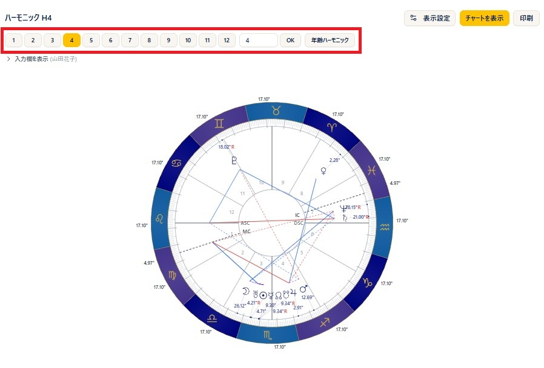
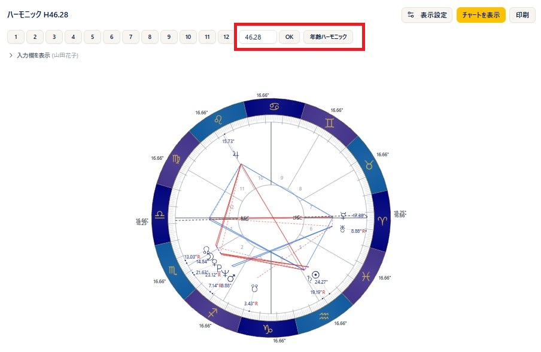
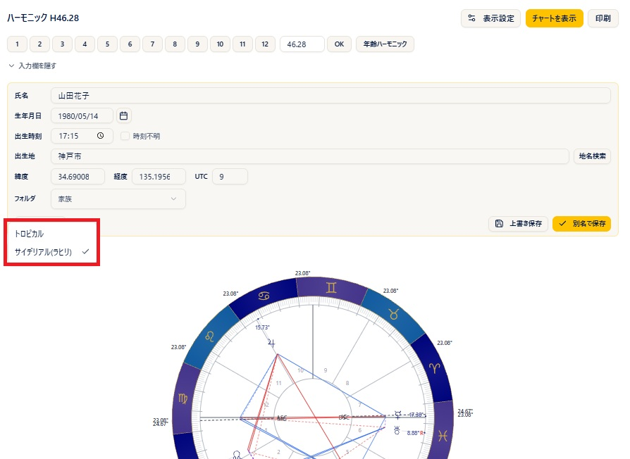

# Harmonic

!!! abstract "About this chapter"
    This chapter covers the harmonic chart. Harmonic charts transform the natal chart by a **harmonic number** you specify. You can pick a preset (1 to 12), enter a custom value, or use the **age harmonic**, which calculates from the subject's age.

    The screen is split in two, with the **harmonic wheel** on the left and the **right panel (Planets, Houses, Aspects, Midpoints)** on the right, so you can check midpoints (half sums) on the same screen. Harmonic charts are available on the **Pro plan and above**.

## Creating a harmonic chart

### Steps

1. Open **Harmonic** from the menu and choose the **birth data** in the header.
2. To correct data on the spot, edit it with the **pencil (edit)** and apply it with **Recalculate**.
3. Choose the harmonic number you want from the **preset (1-12)** buttons at the top. Pressing a button calculates and displays it on the spot.
4. For a number not among the presets, type a value into the field on the right and press **OK** (the **Enter key** works as well). Decimals such as 4.5 are accepted.
5. When birth data is selected, the **Show Chart** button recalculates at the current harmonic number.

### Notes

- The title above the chart shows the current harmonic number in the form **Harmonic H(n)**.
- If you open the page without selecting birth data, the preset, custom entry, and age harmonic controls are not shown. They appear once you select birth data.
- Custom entry accepts values of 0.01 and above. Non-numeric values and values of 0 or below are ignored.
- Changing the zodiac recalculates automatically at the same harmonic number.

## Age harmonic

### Steps

1. Choose the **birth data** in the header (the button only appears when birth data is selected).
2. Press the **Age Harmonic** button.
3. The current age in completed years, derived from the date of birth and given to two decimal places, is used directly as the harmonic number.

### Notes

- The calculated age is also placed in the custom entry field, so you can fine-tune it from there and recalculate.

## Choosing the zodiac

### Steps

1. Choose **Tropical** or **Sidereal (Lahiri)** from the **Zodiac** selector.
2. Changing it recalculates automatically at the same harmonic number.

### Notes

- The houses of a harmonic chart are always calculated as **equal houses (30 degrees at a time from the ASC after the harmonic transformation)**, so unlike the other charts there is no house system selector.
- The MC is shown at its position after the harmonic transformation and is not tied to the house cusps (a floating MC).

## Reading the right panel

### Notes

- There are four tabs: **Planets / Houses / Aspects / Midpoints**.
- **Planets** tab: lists the planets after the harmonic transformation (planet, sign, degree, and so on).
- **Houses** tab: lists the houses and the planets in each one.
- **Aspects** tab: shows the list and grid of aspects within the harmonic chart. **Aspect patterns** are shown as well when there are any.
- **Midpoints** tab: shows the midpoints (half sums).
- Until a chart has been calculated, each tab shows "No data".

## Midpoints (half sums)

### Steps

1. Open the **Midpoints** tab in the right panel.
2. Switch the **Harmonic** and the **Display Mode (All Axes / Stimulation)** to choose what you want to see.
3. The **print** button inside the tab prints the midpoints in landscape.

### Notes

- The harmonic used for the midpoints is set independently of the harmonic number of the wheel itself.
- For the basics of midpoints, see also [Half sums](https://www.arijp.com/basis/halfsum) on the ARI official site (in Japanese).

## Display and printing

### Steps

1. The **Print** button prints the harmonic wheel and the data in portrait. The file name includes "Harmonic" and the harmonic number (H(n)).
2. Clicking the wheel enlarges it, and from the enlarged view you can save the image with **PNG**.
3. The **Display Settings** button lets you adjust the planets and aspects shown on the spot.

### Notes

- The print button only appears once a chart has been calculated.
- If you print while you have edited the birth data and recalculated, a note saying the data is being edited is added to the print header.

!!! info "Plans"
    Harmonic charts require **Pro and above** (a lock icon on the menu means your plan cannot open it). Once you can open the page, all of the features inside it — midpoints, display settings, and the rest — are available.
