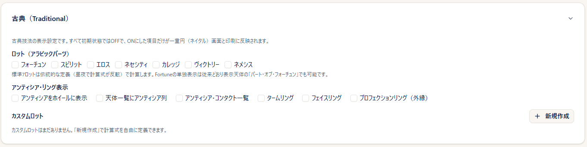
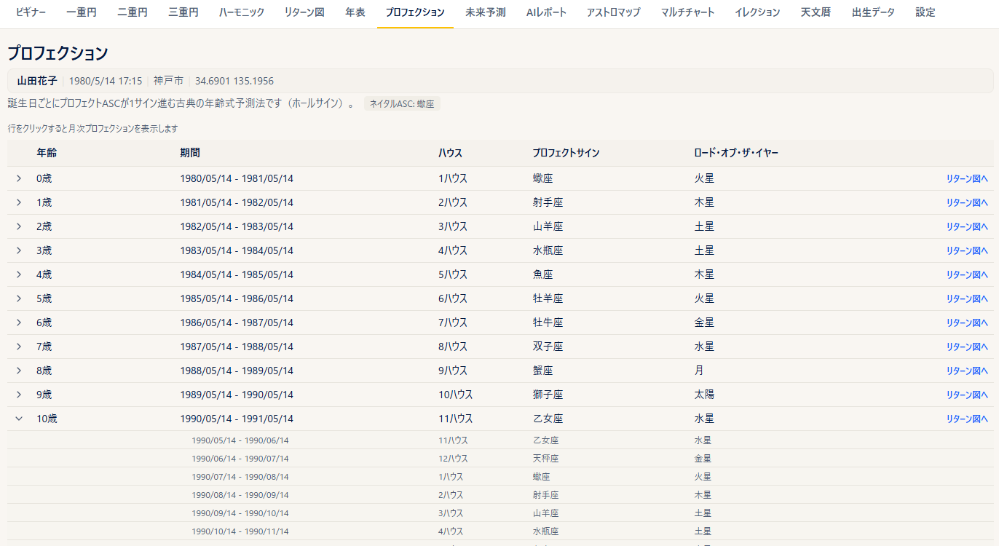
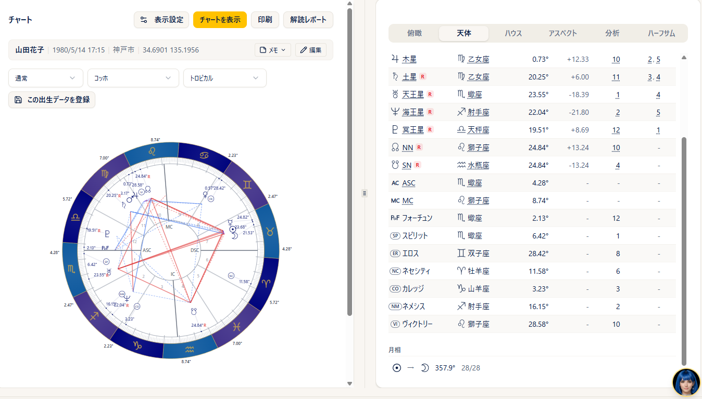
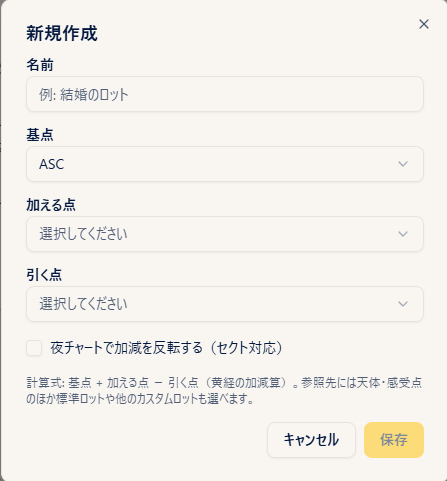
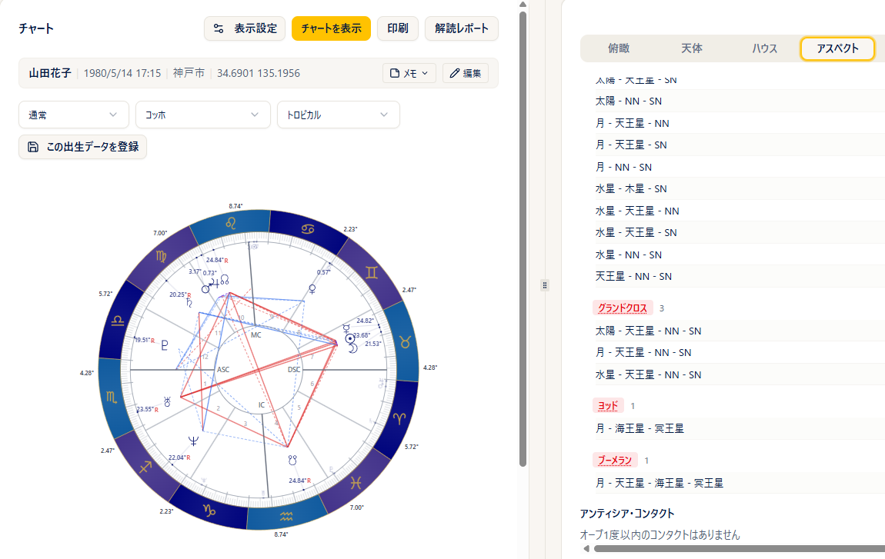
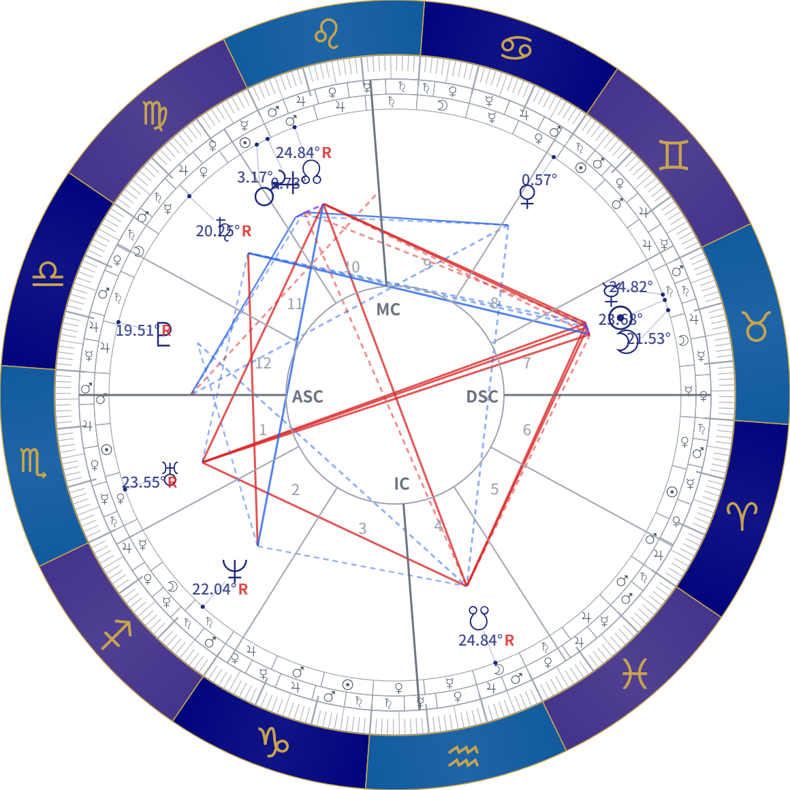

# 古典（プロフェクション・ロット）

!!! abstract "この章について"
    この章では、古典（伝統）占星術の技法をあつかう機能をまとめます。メニューの **プロフェクション**（年齢ごとの年表）と、一重円のチャートに表示できる **ロット（アラビックパーツ）**・**カスタムロット**・**アンティシア**・**タームリング／フェイスリング**・**プロフェクションリング** です。これらは **Max プラン** でご利用いただけます。

    チャートに表示する項目は、初期状態ではすべて OFF です。お使いになる項目だけを ON にしてご覧ください。

## 古典（Traditional）の表示を切り替える

### 操作手順

1. メニューから「**設定**」を開きます。
2. 画面の下の方にある「**古典（Traditional）**」のカードをクリック／タップして開きます。
3. 「**ロット（アラビックパーツ）**」で、チャートに表示するロットにチェックを入れます。
4. 「**アンティシア・リング表示**」で、表示したい項目にチェックを入れます。
5. 「**上書き保存**」を押すと、選択中のプリセットに保存されます。
6. 一重円のチャート画面では、右上の「**表示設定**」からも同じ項目を切り替えられます。

### 補足説明

- ON にしている項目がないときは、カードは畳まれた状態で表示されます。ON の項目があるときは、カードの見出しの右にその個数が表示されます。
- 設定はプリセットごとに保存されます。プリセットについては [設定](settings.md) の章の「プリセットの作り方」をご覧ください。
- ON にした項目が反映されるのは、**一重円** の画面と、その印刷です。二重円・三重円など他の画面には表示されません。
- 龍頭図・龍尾図（ドラコニックチャート）を表示している間と、ステップ計算で日時を動かしている間は、ロット・アンティシア・プロフェクションリングは表示されません。

## プロフェクション

### 操作手順

1. メニューから「**プロフェクション**」を開きます。ヘッダーで **出生データ** を選びます。
2. 0歳から100歳までの年表が表示されます。現在の年齢の行には「**今年**」のバッジが付き、画面を開いたときにその行までスクロールします。
3. 各行には、**年齢／期間／ハウス／プロフェクトサイン／ロード・オブ・ザ・イヤー** が表示されます。
4. 行をクリック／タップすると、その1年を12に分けた **月次プロフェクション** が下に開きます。もう一度クリック／タップすると閉じます。
5. 各行の右端の「**リターン図へ**」を押すと、その年を検索年としてリターン図の画面が開きます。

### 補足説明

- 期間は、誕生日からその翌年の誕生日の前日までです。月次の各期間は、誕生日と同じ日を区切りとしています（その月に同じ日がない場合は月末）。
- 画面上部には、出生図の **ネイタルASC** のサインが表示されます。
- 出生時刻が不明な出生データでは計算できません。その場合は年表の代わりに案内が表示されます。
- 「リターン図へ」を押した時点では計算は行われません。リターン図の画面で内容を確認し、「**チャートを表示**」を押してください。リターン図の操作は [リターン図](return-chart.md) の章をご覧ください。

## ロット（アラビックパーツ）

### 操作手順

1. 「古典（Traditional）」の「**ロット（アラビックパーツ）**」で、表示したいロットにチェックを入れます。標準では **フォーチュン／スピリット／エロス／ネセシティ／カレッジ／ヴィクトリー／ネメシス** の7つから選べます。
2. 一重円のチャートを表示すると、選んだロットが天体と同じように円盤上に配置されます。
3. 右パネルの「**天体位置**」タブにも、選んだロットのサイン・度数・ハウスが表示されます。

### 補足説明

- フォーチュンはパート・オブ・フォーチュンの記号、その他のロットは略号を入れた丸印で表示されます（スピリット＝SP、エロス＝ER、ネセシティ＝NC、カレッジ＝CO、ヴィクトリー＝VI、ネメシス＝NM）。
- 標準の7つのロットは、伝統的な定義（昼のチャートと夜のチャートで計算式が反転するもの）で計算されます。
- パート・オブ・フォーチュンだけを表示したい場合は、これまでどおり表示天体の「**パート・オブ・フォーチュン**」でも表示できます。その場合の計算式は、設定の「パート・オブ・フォーチュンの計算式」に従います。
- 出生時刻が不明な出生データでは、ロットは表示されません。

## カスタムロット

{ width="420" }

### 操作手順

1. 「古典（Traditional）」の下部にある「**カスタムロット**」で「**新規作成**」を押します。
2. 「**名前**」を入力します。
3. 「**基点**」「**加える点**」「**引く点**」をそれぞれ選びます。天体・感受点のほか、標準のロットや、ご自身が作った他のカスタムロットも選べます。
4. 夜のチャートで加える点と引く点を入れ替える場合は、「**夜チャートで加減を反転する（セクト対応）**」にチェックを入れます。
5. 「**保存**」を押すと一覧に追加されます。名前の右には、選んだ内容が「**式**」として表示されます。
6. 作成したロットは「ロット（アラビックパーツ）」のチェック欄に標準のロットと並びます。チェックを入れると、チャートと「天体位置」タブに表示されます。

### 補足説明

- 一覧の **鉛筆** アイコンで編集、**ゴミ箱** アイコンで削除できます。削除すると、表示の選択からも自動的に外れます。
- 同じ名前のカスタムロットは作成できません。
- 作成できるカスタムロットは 50 個までです。
- 編集中のロット自身は、参照先の選択肢には表示されません。
- チャートの円盤上では、名前の先頭2文字を入れた丸印で表示されます。

## アンティシア

### 操作手順

1. 「古典（Traditional）」の「**アンティシア・リング表示**」で、必要な項目にチェックを入れます。
    - **アンティシアをホイールに表示**：チャートの円盤に、各天体のアンティシアの位置を薄い記号で重ねて表示します。
    - **天体一覧にアンティシア列**：右パネルの「天体位置」タブに、アンティシアの位置の列が加わります。
    - **アンティシア・コンタクト一覧**：右パネルの「アスペクト」タブの下に、コンタクトの一覧が表示されます。
2. 一重円のチャートを表示すると、選んだ内容が反映されます。

### 補足説明

- コンタクト一覧では、**種別** の欄に **アンティシア** か **コントラアンティシア** かが表示されます。
- 該当するものがない場合は、「**オーブ1度以内のコンタクトはありません**」と表示されます。
- アンティシアは表示のみの機能です。アスペクト表・出生図解読レポート・AIレポートの内容には影響しません。

## ターム・フェイスリング

{ width="520" }

### 操作手順

1. 「古典（Traditional）」の「**タームリング**」「**フェイスリング**」にチェックを入れます。
2. 一重円のチャートを表示すると、サインの帯の内側にリングが表示されます。タームは各サインを5つに、フェイスは10度ずつ3つに分けた区分が、支配星の記号で示されます。

### 補足説明

- タームの区分は、設定の「**ターム方式**」で選んでいる方式に従います。
- リングを表示すると、天体の記号と度数の表示位置は、リングの幅のぶんだけ内側に寄ります。
- タームリングとフェイスリングは、それぞれ単独でも両方同時でも表示できます。

## プロフェクションリング

### 操作手順

1. 「古典（Traditional）」の「**プロフェクションリング（外縁）**」にチェックを入れます。
2. 一重円のチャートを表示すると、円のいちばん外側に、各サインに対応する年齢が表示されます。
3. チャート画面の上部に表示される「**プロフェクション ○〜○歳**」の選択欄で、表示する12年の範囲を選べます。

### 補足説明

- 初期状態では、現在の年齢を含む12年が選ばれています。0歳から始まる12年ごとの範囲を選べます。
- 表示されるのは選んだ12年ぶんの1層だけです。重ねて表示することはできません。
- 出生データを切り替えると、表示する範囲は現在の年齢を含む12年に戻ります。
- 出生時刻が不明な出生データでは表示されません。

## 表示・印刷

### 操作手順

1. ON にした古典の表示は、一重円の印刷にもそのまま反映されます。
2. 印刷の手順は [一重円](single-chart.md) の章の「表示・印刷」をご覧ください。

### 補足説明

- 画面で拡大・縮小した場合も、リングやロットは同じように追随します。
- プロフェクションの年表の画面には、印刷用のボタンはありません。印刷される場合は、ブラウザの印刷機能をお使いください。
