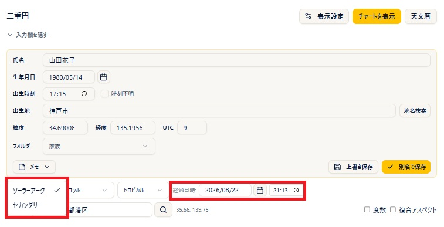
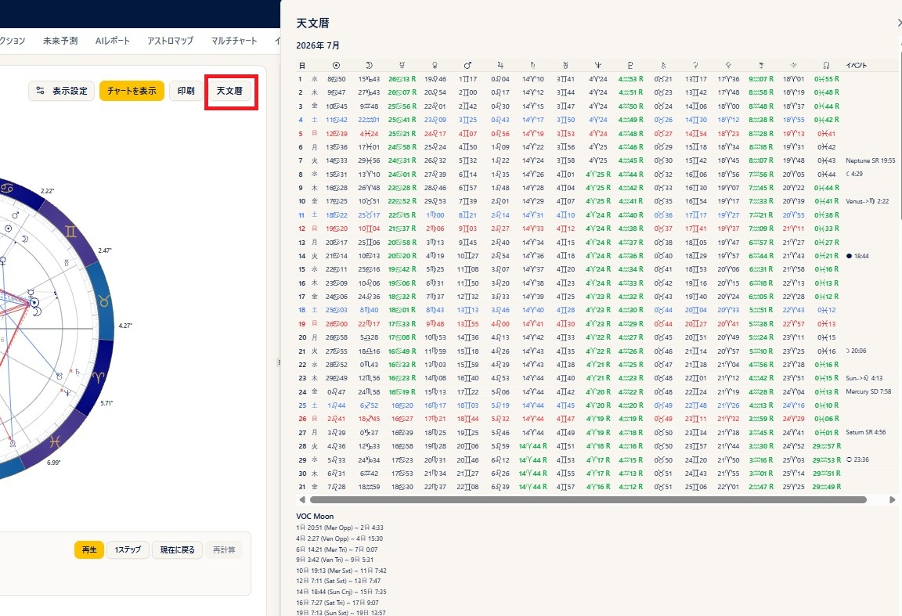
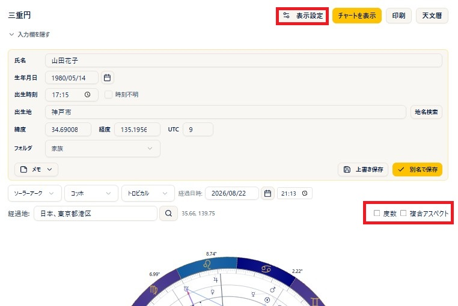

# Progression

!!! abstract "About this chapter"
    This chapter covers the tri-wheel (the progressed and transit chart). The tri-wheel layers three charts: **the inner ring is the natal chart (N)**, **the middle ring is the progressed chart**, and **the outer ring is the transit chart (T)**. The progression method can be **solar arc** or **secondary** (the day-for-a-year method).

    For the basics of transits, see also [Transits](https://www.arijp.com/basis/transit) on the ARI official site (in Japanese).

## Creating a tri-wheel

### Steps

1. Open **Progression** from the menu and choose the **birth data** in the header. To correct data on the spot, edit the values directly in the **birth data form** (press **Show Chart** to apply your edits).
2. Choose **Solar Arc** or **Secondary** from the **Direction Type** selector (the default is solar arc).
3. Enter the **Date/Time** of the transit (the default is the current date and time). The date and the time are set separately.
4. Enter a place name for the **Transit Location** (choose from the suggestions, or search with the magnifier button = Basic and above). The default is the observation location in your settings.
5. Choose a **house system** if you need to.
6. Press **Show Chart** and the tri-wheel appears.

### Notes

- With the Standard color theme, the three rings are, from the inside, **N (natal) = black / progressed = green / T (transit) = red**. The label of the middle ring changes with the progression method: **D (solar arc) or P (secondary)**.
- The planets shown on each ring follow your settings preset. You can also change them in real time from Display Settings.
- Clicking a planet pops up the list of aspects to it (badges are black for N, green for the progressed ring, and red for T). Angles such as the **ASC and MC** can be clicked too.

## Reading the right panel

### Notes

- The tabs are **Overview / Natal (N) / Direction (D) (or Secondary (P) when secondary is selected) / Transit (T) / Aspects / Midpoints**.
- **Overview** tab: lists the planets and aspects of N, the progressed chart, and T together (the same layout as the previous StarNavigator).
- **N / D (P) / T** tabs: the planet table for each ring (planet, sign, degree, declination; the N tab also has the house and houses-ruled columns and a list of the houses) and the moon phase. The **Essential Dignity** button at the bottom right of the planet table (**Pro and above**) opens the dignity table, including the almuten, in a separate window (see the [Analysis Tab](analysis-tab.md) chapter; the house-cusp almuten table is included only for N).
- **Aspects** tab: shows an aspect grid for each of the sections **N-N / N-P (N-D) / N-T / P-P (D-D) / P-T (D-T) / T-T**. Each cell shows the orb and a **plus sign (separating) or minus sign (applying)**, and clicking a cell pops up the aspect type, the orb, whether it is applying or separating, and its **meaning (keywords)**. Below the aspect grid is the list of **aspect patterns** (when you calculated with the Aspect Patterns checkbox on).
    
- **Midpoints** tab: shows the midpoints (half sums) (see the next section).
- In the tables on the Overview tab, the list of houses on the N tab, and each aspect grid, underlined items (**planets, signs, houses, aspects**, and so on) show their meaning when clicked (the planet tables on the N / D (P) / T tabs do not show meanings).

## Midpoints (N/N, D/D, and T/T)

The **Midpoints** tab in the right panel lets you analyze midpoints (half sums) (**Plus and above**). Switching the **MP Pair** lets you analyze not only **N/N (natal to natal)** but also **D/D (progressed to progressed; P/P when secondary is selected)** and **T/T (transit to transit)** midpoints.

### Notes

- The harmonic, display mode, orb, planet filtering, and other controls work exactly as described under "Midpoints tab" in the [Natal](single-chart.md) chapter.
- For the basics of midpoints, see also [Half sums](https://www.arijp.com/basis/halfsum) on the ARI official site (in Japanese).

## Stepping (animating the chart)

The controls below the chart let you advance the date and time little by little and watch the chart change, like an animation (**Pro and above**).

### Steps

1. Choose the **Interval** (1 day, for example) and the **Speed** (1s, for example) below the chart.
2. Pressing **Play** advances the date and time automatically and the chart changes as it goes. Pressing **1 Step** advances one frame at a time.
3. Ticking **Backward** moves back into the past instead.

## Ephemeris

### Steps

1. Press the **Ephemeris** button in the header (**Plus and above**).
2. A dialog opens with three months of ephemeris data, starting from the month before the transit date. You can check the movement of the planets in the ephemeris while you build the tri-wheel.

### Notes

- For each day it shows the degree of each planet (sign, degree, minute, with R for retrograde), ingresses, moon phase and direct/retrograde changes, the **void-of-course Moon**, aspects between planets, and more.
- There is also a separate **Ephemeris** menu that generates PDFs (explained in the [Ephemeris](ephemeris.md) chapter).

## Display and printing

### Steps

1. Ticking **Degrees** shows the degree next to each planet.
2. Ticking **Aspect Patterns** calculates and displays the combined patterns (**Basic and above**; the calculation takes a little time, so turn it on only when you need it).
3. **Display Settings** lets you adjust planets, aspects, houses, colors, the progression method, and more on the spot (**Plus and above**).
4. The **Print** button prints the tri-wheel and the data (**Basic and above**, portrait). The Midpoints tab prints in landscape.
5. Clicking the wheel enlarges it, and you can save the image with **PNG** (PNG saving is **Basic and above**).

### Notes

- **Transit Mode** in Display Settings can be set to the date of the **Next Solar Return** or the **Previous Solar Return** as well as Normal.
- **Show asteroids and points** is a simple toggle for free and guest users.
- Degree notation (decimal or degrees-minutes) follows the degree mode in the settings.
